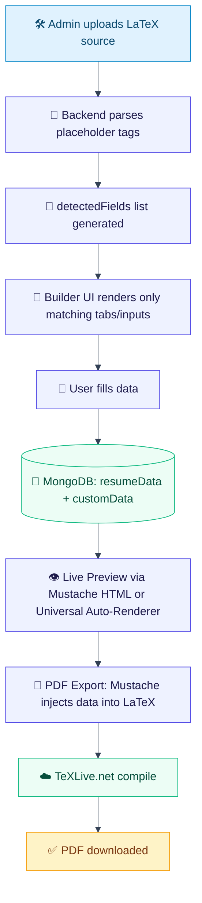
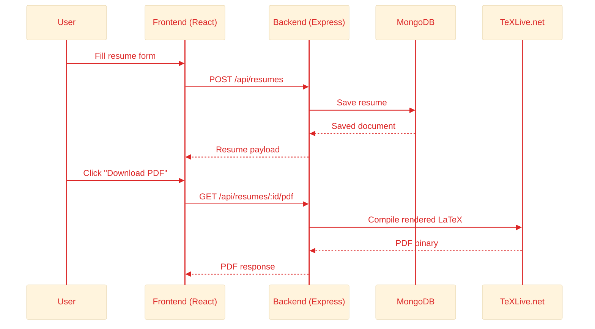
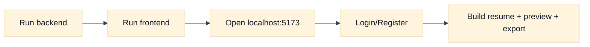
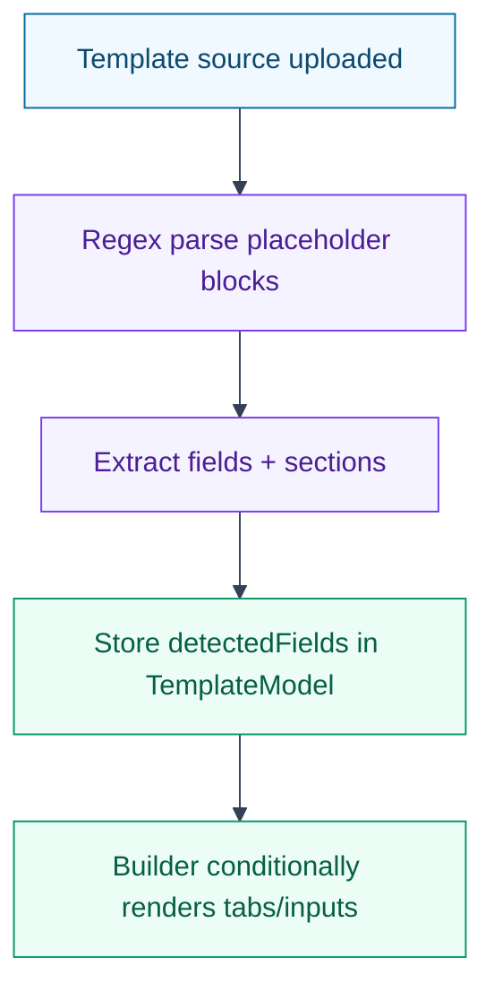
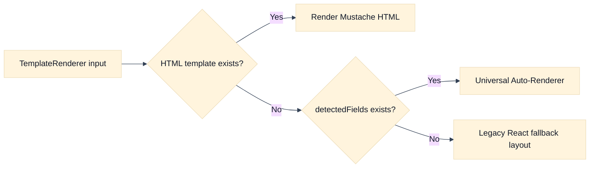

<div align="center">

# 📄 ResumeForge
### LaTeX-Powered Resume Builder

<p>
  
  
  
  
</p>

> **An Overleaf + Canva hybrid** — Build professional resumes from LaTeX templates with a live, dynamic form-driven editor.

</div>

---

## 📚 Table of Contents

- [✨ Overview](#overview)
- [🚀 Features](#features)
- [🧠 Architecture](#architecture)
- [🛠️ Tech Stack](#tech-stack)
- [📁 Project Structure](#project-structure)
- [⚙️ Setup & Installation](#setup--installation)
- [📐 Template System](#template-system)
- [🔑 Roles & Authentication](#roles--authentication)
- [📡 API Reference](#api-reference)
- [🧩 How the Live Preview Works](#how-the-live-preview-works)
- [📸 Screenshots](#screenshots)
- [📝 License](#license)
- [🙏 Acknowledgements](#acknowledgements)

---

<a id="overview"></a>
## ✨ Overview

**ResumeForge** is a full-stack MERN application that lets users create polished, LaTeX-quality resumes through a clean, modern UI — without ever touching LaTeX code.

Admins upload LaTeX templates with `[[ variable ]]` placeholders. The system automatically detects every field and section, generates the corresponding form inputs, and renders a live preview that mirrors the final PDF output exactly.

---

<a id="features"></a>
## 🚀 Features

### 👤 For Users
- 🖊️ **Dynamic Form Builder** — Only the sections present in the chosen template appear in the editor (no clutter).
- 👁️ **Live Preview** — See your resume update in real-time as you type, with a layout that matches the template.
- 📄 **LaTeX PDF Export** — Compiles your resume via the TeXLive.net API, producing a professional-grade PDF.
- 🖨️ **HTML Print Export** — Instantly print or save the browser preview as a PDF.
- 📋 **Sample Preview** — View example PDFs for each template before choosing.
- 🎨 **Template Gallery** — Browse and switch between multiple resume templates, each with its own design.

### 🛠️ For Admins
- ⬆️ **Upload Any LaTeX Template** — Paste any LaTeX source with `[[ field ]]` placeholders.
- 🔍 **Auto Variable Detection** — The system parses the source and extracts all `[[ variables ]]` automatically, no configuration needed.
- 📐 **HTML Preview Source** — Optionally paste an HTML/CSS snippet for a pixel-perfect browser preview.
- 📑 **Sample PDF Upload** — Link to a sample PDF so users can see what the final output looks like before editing.
- 🗑️ **Template Management** — Create, edit, activate/deactivate, and delete templates from the dashboard.

---

<a id="architecture"></a>
## 🧠 Architecture

### The "Source-First" Variable-Driven Pipeline



### Request/Service Flow



---

<a id="tech-stack"></a>
## 🛠️ Tech Stack

<div align="center">

  
</div>

<div align="center">

| 🧱 Layer | ⚙️ Technologies | 🎯 Why Used |
|---|---|---|
| 🎨 Frontend | React 18 + TypeScript + Vite | Fast DX, component architecture, type safety |
| 🪄 Styling | Tailwind CSS + Framer Motion | Utility-first design + smooth animations |
| 🚀 Backend | Node.js + Express 5 + TypeScript | Scalable REST API with typed server code |
| 🗄️ Database | MongoDB Atlas + Mongoose | Flexible schema for dynamic resume/template data |
| 🔐 Auth | JWT + bcryptjs | Secure login and role-based access |
| 🧩 Templating | Mustache.js (`[[ ]]` tag syntax) | Clean placeholder-based rendering |
| 📄 PDF Engine | TeXLive.net Remote Compilation API | High-quality LaTeX resume output |

</div>

> 🔗 **Quick Links:** [React](https://react.dev) • [TypeScript](https://www.typescriptlang.org) • [Vite](https://vite.dev) • [TailwindCSS](https://tailwindcss.com) • [Express](https://expressjs.com) • [MongoDB](https://www.mongodb.com) • [TeXLive](https://texlive.net)


---

<a id="project-structure"></a>
## 📁 Project Structure

```text
ResumeBuilder/
├── backend/
│   ├── controllers/
│   │   ├── authController.ts       # JWT login/register
│   │   ├── resumeController.ts     # CRUD + LaTeX PDF generation
│   │   └── templateController.ts   # Template CRUD + auto field detection
│   ├── models/
│   │   ├── ResumeModel.ts          # Resume schema (with flexible customData)
│   │   ├── TemplateModel.ts        # Template schema (with detectedFields)
│   │   └── UserModel.ts
│   ├── middleware/
│   │   └── authMiddleware.ts       # protect + adminOnly guards
│   ├── routes/
│   │   ├── authRoutes.ts
│   │   ├── resumeRoutes.ts
│   │   └── templateRoutes.ts
│   └── server.ts
│
└── frontend/
    └── src/
        ├── components/
        │   ├── TemplateRenderer.tsx  # 3-path smart renderer
        │   └── Navbar.tsx
        ├── pages/
        │   ├── Builder.tsx           # Dynamic resume editor
        │   ├── AdminDashboard.tsx    # Template management
        │   ├── Dashboard.tsx         # User resume list
        │   ├── Login.tsx
        │   └── Register.tsx
        └── utils/
            └── api.ts                # Axios instance
```

---

<a id="setup--installation"></a>
## ⚙️ Setup & Installation

> ✅ Follow this in order to run the full stack locally without issues.

### 🧰 Prerequisites
- Node.js v18+
- MongoDB Atlas account (or local MongoDB)
- Git

### 1️⃣ Clone the Repository
```bash
git clone https://github.com/Ankitarai27/ResumeBuilder.git
cd ResumeBuilder
```

<details>
<summary>Alternative example clone path</summary>

```bash
git clone https://github.com/your-username/resume-forge.git
cd resume-forge
```
</details>

### 2️⃣ Backend Setup
```bash
cd backend
npm install
```

Create a `.env` file in `backend/`:
```env
PORT=5001
MONGO_URI=mongodb+srv://<user>:<password>@cluster.mongodb.net/resume-builder-db
JWT_SECRET=your_super_secret_key_here
```

Start the backend:
```bash
npm run dev
```

### 3️⃣ Frontend Setup
```bash
cd ../frontend
npm install
npm run dev
```

The app will be available at **http://localhost:5173**


### 🌐 Deployment Quick Links
- Frontend (Vercel): https://vercel.com/new
- Backend (Render): https://dashboard.render.com/
- MongoDB Atlas: https://cloud.mongodb.com/

### Local Runtime Flow



---

<a id="template-system"></a>
## 📐 Template System

### 🧾 How to Write a Compatible Template

Use `[[ variableName ]]` for simple fields and `[[ #sectionName ]]` / `[[ /sectionName ]]` for list sections.

**🔹 Simple fields:**
```latex
\textbf{[[ firstName ]]} [[ lastName ]]
\href{mailto:[[ email ]]}{[[ email ]]} | [[ phone ]]
```

**🔹 List sections:**
```latex
[[ #experience ]]
\textbf{[[ company ]]} | [[ role ]]
[[ duration ]] — [[ location ]]
[[ description ]]
[[ /experience ]]
```

### 🧠 Standard Field Aliases

| Template Variable    | Maps To                    |
|----------------------|----------------------------|
| `firstName`          | First word of Full Name    |
| `lastName`           | Rest of Full Name          |
| `website`            | Portfolio URL              |
| `objective`          | Professional Summary       |
| `fullName`           | Full Name field            |


### 🧩 Supported Sections

| Block                    | Builder Tab       |
|--------------------------|-------------------|
| `[[ #experience ]]`      | Experience        |
| `[[ #education ]]`       | Education         |
| `[[ #projects ]]`        | Projects          |
| `[[ #certifications ]]`  | Certifications    |
| `[[ #links ]]`           | Links             |
| `[[ #coursework ]]`      | Coursework        |
| `[[ #training ]]`        | Training          |
| `[[ #publications ]]`    | Publications      |

### Template Parsing Flow



---

<a id="roles--authentication"></a>
## 🔑 Roles & Authentication

| Role    | Capabilities                                                      |
|---------|-------------------------------------------------------------------|
| `user`  | Register, login, create/edit/delete their own resumes            |
| `admin` | All user capabilities + full template management dashboard        |

To make a user an admin, set `role: 'admin'` directly in MongoDB.

---

<a id="api-reference"></a>
## 📡 API Reference

### Auth
| Method | Endpoint              | Description        |
|--------|-----------------------|--------------------|
| POST   | `/api/auth/register`  | Register new user  |
| POST   | `/api/auth/login`     | Login, get JWT     |

### Resumes
| Method | Endpoint               | Description            |
|--------|------------------------|------------------------|
| GET    | `/api/resumes`         | Get all user resumes   |
| POST   | `/api/resumes`         | Create new resume      |
| GET    | `/api/resumes/:id`     | Get single resume      |
| PUT    | `/api/resumes/:id`     | Update resume          |
| DELETE | `/api/resumes/:id`     | Delete resume          |
| GET    | `/api/resumes/:id/pdf` | Compile & download PDF |

### Templates
| Method | Endpoint                  | Description                  |
|--------|---------------------------|------------------------------|
| GET    | `/api/templates`          | Get all templates (admin)    |
| GET    | `/api/templates/active`   | Get active templates         |
| POST   | `/api/templates`          | Create template (admin)      |
| PUT    | `/api/templates/:id`      | Update template (admin)      |
| DELETE | `/api/templates/:id`      | Delete template (admin)      |

---

<a id="how-the-live-preview-works"></a>
## 🧩 How the Live Preview Works

The `TemplateRenderer` component uses a **3-path rendering strategy**:

1. **Custom HTML Template** — If the admin provided HTML/CSS source, it's rendered via Mustache with all user data injected.
2. **Universal Auto-Renderer** — If the template has `detectedFields` (any LaTeX upload), the renderer automatically generates a two-column or single-column layout mirroring the template's structure.
3. **Legacy Fallback** — The original React-based default layout.



---

<a id="screenshots"></a>
## 📸 Screenshots

> Add screenshots of the Builder, Admin Dashboard, and generated PDF here.

---

<a id="license"></a>
## 📝 License

MIT — feel free to use and modify for personal or commercial projects.

---

<a id="acknowledgements"></a>
## 🙏 Acknowledgements

- [Deedy-Resume](https://github.com/deedy/Deedy-Resume) — LaTeX resume template
- [TeXLive.net](https://texlive.net) — Remote LaTeX compilation API
- [Mustache.js](https://github.com/janl/mustache.js) — Logic-less template engine
